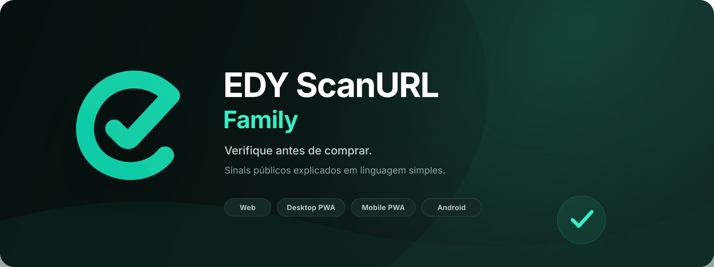
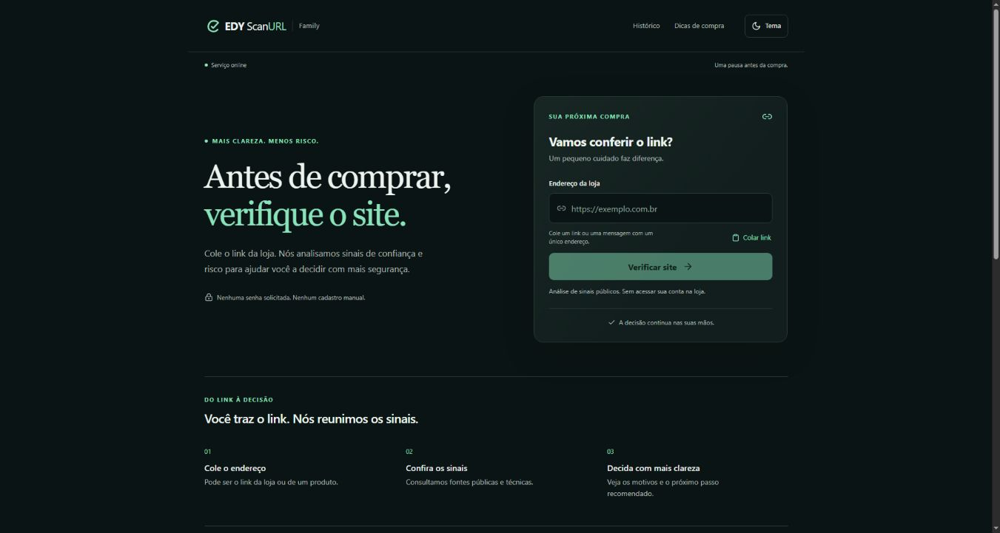
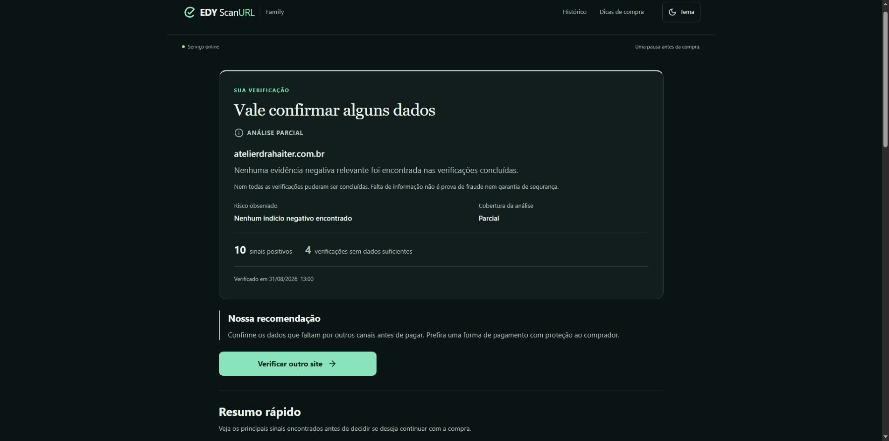
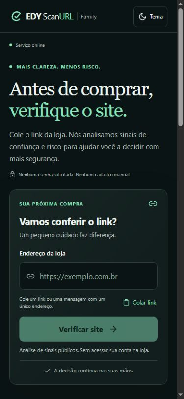
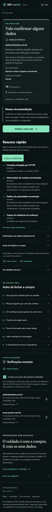
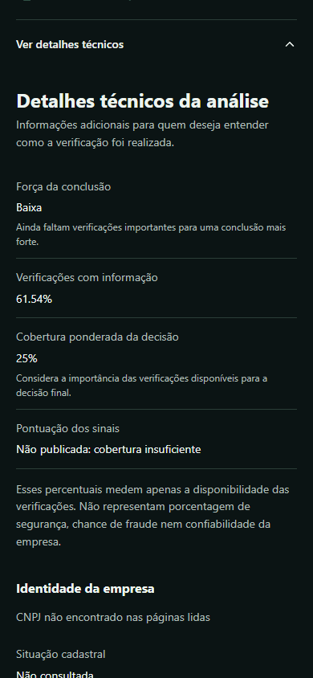
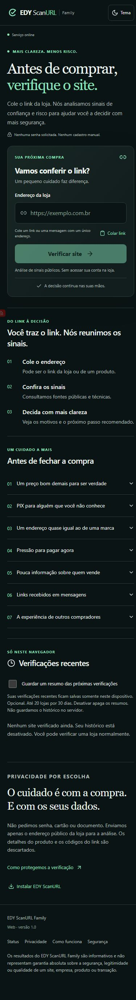

<p align="center">
  
</p>

# EDY ScanURL Family

Aplicação defensiva, em português, para ajudar famílias a avaliar sinais públicos de uma loja antes de comprar. O usuário cola ou compartilha um link e recebe uma conclusão simples, os principais motivos, recomendações e a cobertura real da análise.

> A análise reduz riscos, mas não garante a segurança de uma compra. Sempre confirme identidade, pagamento, políticas e reputação da loja.

## Apresentação em vídeo

https://github.com/user-attachments/assets/aa651fb7-86b4-4a85-8d87-a624db29d7a1

## Live Demo

[Abrir o EDY ScanURL Family](https://edy-scanurl-family.pages.dev/)

Status público: **FINAL WEB BUILD DEPLOYED — READY FOR FINAL PHYSICAL CONFIRMATION**.

## Platforms

| Experiência | Status | Observação |
|---|---|---|
| Web | Production | Cloudflare Pages, responsivo |
| Desktop Browser | Supported | Chrome e navegadores modernos |
| Desktop PWA | Supported | Instalação e modo standalone validados; confirmação física final pendente |
| Mobile Web | Supported | Layout otimizado para telas pequenas |
| Mobile PWA | Supported | Manifest, service worker e shell offline |
| Android APK | Supported | Aplicativo Capacitor assinado; confirmação física final pendente |
| iOS | Web/PWA only | Não existe aplicativo iOS nativo |

Não existe aplicativo Windows nativo ou arquivo `.exe`. No computador, a experiência é **Web / Desktop PWA**.

## Features

- resultado em linguagem simples: **Confiável**, **Atenção** ou **Alto risco**;
- estado de **Análise parcial** quando faltam dados, sem transformar ausência em risco;
- risco observado separado da cobertura da análise;
- motivos principais, recomendações e explicação de cada verificação;
- botão para colar links e recebimento de links compartilhados no Android;
- histórico opcional armazenado no dispositivo, com ação para limpar;
- temas Escuro, Claro e Usar tema do sistema;
- interface acessível, responsiva e instalável como PWA;
- shell disponível offline, sem fabricar análises quando não há conexão;
- integração com fontes públicas, DNS over HTTPS, RDAP e VirusTotal pelo servidor.

## How it works

1. O usuário cola ou compartilha o endereço da loja.
2. A aplicação normaliza e valida o domínio.
3. O Worker executa verificações defensivas em fontes públicas e técnicas.
4. Evidências positivas, alertas reais, riscos e verificações sem dados são mantidos separados.
5. A interface apresenta uma recomendação simples e permite abrir os detalhes e as fontes.

Nenhum resultado de produção é mockado. Fixtures existem somente nos testes automatizados.

## Analysis result

O resultado principal prioriza a recomendação e distingue quatro grupos: **sinais positivos**, **pontos de atenção reais**, **riscos encontrados** e **verificações sem dados suficientes**. Estados ausente, indisponível e não verificado não recebem penalização automática.

### Conclusion strength

**Força da conclusão** indica se existem dados importantes suficientes para sustentar uma conclusão forte. Os estados são Alta, Moderada e Baixa. Quando baixa, o produto informa que ainda faltam verificações importantes.

### Coverage explanation

- **Verificações com informação**: proporção de verificações que retornaram um estado informativo.
- **Cobertura ponderada da decisão**: considera a importância das verificações disponíveis para a decisão final.
- **Pontuação dos sinais**: não é publicada quando a cobertura é insuficiente.

**Os percentuais apresentados não representam chance de fraude, segurança ou confiabilidade da empresa.**

## Web

O frontend React está em produção no Cloudflare Pages e consome a API HTTPS do EDY ScanURL Family. O bundle público não contém chaves do VirusTotal, tokens Cloudflare ou credenciais de administração.

## Desktop / PWA

Em navegadores desktop modernos, a aplicação pode ser usada em uma aba ou instalada como PWA. A instalação abre em janela standalone, preserva a preferência de tema e mantém o histórico local opcional.

## Mobile / PWA

A interface é mobile-first, aceita touch, respeita áreas seguras e não exige hover. O service worker mantém o shell disponível offline; uma nova análise exige conexão e retorna uma mensagem humana quando o dispositivo está offline.

## Android

Existe um aplicativo Android real baseado em Capacitor:

- package ID: `com.edy.scanurl.family`;
- app name: `EDY ScanURL Family`;
- versionName: `1.0`;
- versionCode: `1`;
- compartilhamento de links: `ACTION_SEND` com `text/plain`;
- cleartext e backup desativados; release não-debuggable.

APK release existente: `EDY-ScanURL-Family-release.apk` — 3.395.141 bytes — SHA-256 `689ccdd7d821b241d0440e588f76390008e746336d8b55db4e4428f9593ed535`.

O APK não é versionado no repositório. Ele pode ser publicado futuramente como asset de GitHub Release após autorização e confirmação física final; esta preparação não recompila, substitui ou altera sua assinatura.

## Architecture

```text
Web / Desktop PWA / Mobile PWA / Android Capacitor
                         │ HTTPS
                         ▼
              Cloudflare Worker API
          ┌──────────────┼──────────────┐
          ▼              ▼              ▼
     DNS / RDAP     fontes públicas  VirusTotal
```

O Worker aplica autenticação automática do cliente, rate limiting, normalização de domínio, proteção contra SSRF, limites de tempo/tamanho/redirecionamento e cache apenas de resultados públicos. O backend Node permanece preservado no monorepo para desenvolvimento e compatibilidade; a produção Family usa a implementação Worker separada.

Veja [Architecture](docs/ARCHITECTURE.md) e [Deployment](docs/DEPLOYMENT.md).

## Stack

- React, TypeScript e Vite;
- PWA com Web App Manifest e service worker;
- Cloudflare Pages e Cloudflare Workers;
- Capacitor para Android;
- Vitest, Playwright, ESLint e TypeScript;
- DNS over HTTPS, RDAP e integração server-side com VirusTotal.

## Security & Privacy

- bloqueio de localhost, redes privadas e endpoints de metadados de nuvem;
- validação de URL e domínio antes de qualquer consulta;
- timeouts, limites de tamanho e redirecionamentos controlados;
- rate limiting por dispositivo/IP;
- logs mínimos e sanitizados;
- histórico de navegação não armazenado no servidor;
- análises e credenciais não armazenadas no cache do service worker;
- segredos exclusivos do servidor e excluídos do repositório, bundle e APK.

Detalhes em [Security](SECURITY.md) e [Security architecture](docs/SECURITY.md).

## VirusTotal integration

A chave do VirusTotal existe somente como secret do Worker. O navegador e o APK recebem apenas o resultado sanitizado. O fluxo é defensivo e somente de leitura: não envia URLs novas para análise nem solicita reanálise automática.

## Tests

O projeto possui testes unitários e de integração por workspace, E2E Playwright, cenários reais controlados, validações PWA offline/online, verificações de segurança e verificação do APK existente. Os números realmente executados nesta preparação estão em [Testing](docs/TESTING.md).

```bash
npm test
npm run lint
npm run typecheck
npm run build
npm run web:e2e
npm run web:security
npm run audit:prod
```

## Screenshots

### Web desktop



### Resultado desktop



### Mobile

<p align="center">
  
  
  
</p>

### Mobile PWA

<p align="center">
  
</p>

As imagens foram capturadas da aplicação real. Não são mockups de funcionalidade.

## Local setup

Requisitos: Node.js `24.17.0` ou superior e npm.

```bash
npm ci
npm run typecheck
npm test
npm run web:build
```

Para iniciar a Web local, use `npm run web:local`. Nenhum segredo é necessário para inspecionar a interface; integrações reais do backend exigem configuração privada e autorização do mantenedor.

## Environment variables

Use [.env.example](.env.example) somente como referência. Todos os valores sensíveis devem permanecer fora do Git. Nunca faça commit de `.env`, `.dev.vars`, tokens, chaves, certificados, keystores ou credenciais Android.

Variáveis públicas do Vite devem conter apenas origens públicas autorizadas. Segredos como `VIRUSTOTAL_API_KEY`, tokens Cloudflare e material de assinatura nunca podem usar o prefixo `VITE_`.

## Project structure

```text
apps/
  api/       backend Node preservado
  web/       frontend React/PWA
  worker/    API Cloudflare Workers da edição Family
packages/
  core/      regras e modelos compartilhados
android/     projeto Capacitor Android
scripts/     build, QA e validações
tests/       E2E e regressões
docs/        documentação e imagens públicas
```

## Limitations

- o resultado depende da disponibilidade e cobertura das fontes externas;
- ausência temporária de dados não prova fraude e não vira risco automaticamente;
- dados cadastrais podem estar incompletos ou desatualizados na origem;
- a análise não substitui verificação humana, pagamento seguro ou orientação jurídica;
- PWA no iOS depende dos recursos do Safari; não existe app iOS nativo;
- falta a confirmação física final em dispositivos reais para validação integral.

## Production status

**FINAL WEB BUILD DEPLOYED — READY FOR FINAL PHYSICAL CONFIRMATION**

O status **FINAL PRODUCTION VALIDATED** não foi atribuído. Worker e Web/PWA estão publicados, mas a confirmação física final em dispositivos reais permanece pendente.

## License

Distribuído sob a [MIT License](LICENSE).
